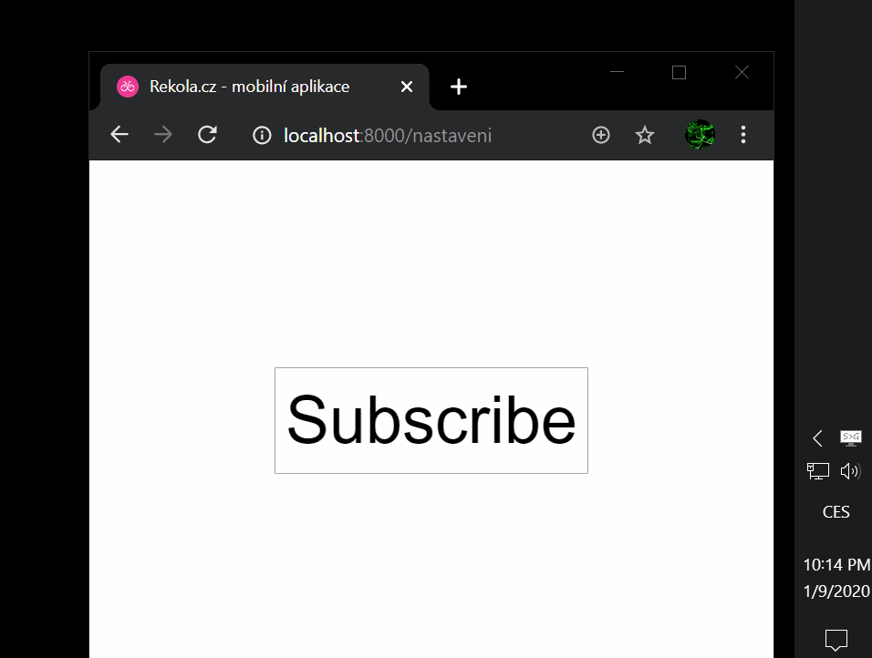

# OneSignal custom button helper

## Installation

`npm install --save onesignal-custom-button-helper`

## Usage

Follow OneSignal documentation to init OneSignal SDK. Hide default subscribe button provided by OneSignal by setting.

### Javascript (OneSignal SDK initialization)

```javascript
var OneSignal = window.OneSignal || []
OneSignal.push(function() {
	OneSignal.init({
		appId: 'your-onesignal-app-id',
		notifyButton: {
			enable: false, // Hides OneSignal circular bell button
		},
	})
})
```

### HTML

```html
<button type="button" id="togglePush" style="display: none;"></button>
```

### JavaScript (custom button handler)

```js
import { onesignalCustomButtonHelper } from 'onesignal-custom-button-helper'

const $button = document.querySelector('#togglePush')

const toggle = onesignalCustomButtonHelper((state) => {
	if (state === 'not-supported') {
		// Keep toggle button hidden
		return
	}

	if (state === 'loading') {
		// Prevent user from clicking it
		$button.disabled = true
		$button.innerText = 'Loading…'
	} else {
		// Reenable and show button if not visible
		$button.disabled = false
		$button.style.display = 'inline-block'

		// Update text accordingly
		if (state === 'subscribed') {
			$button.innerText = 'Unsubscribe'
		}
		if (state === 'not-subscribed') {
			$button.innerText = 'Subscribe'
		}
	}
})

// Toggle subscription on button click
$button.addEventListener('click', toggle)
```

## Screencast



## State

- `'subscribed'` - user is subscribed
- `'not-subscribed'` - user is not yet subscibed or has unsubscribed
- `'loading'` - transitioning between states
- `'not-supported'` - browser doesn't support push notifications - hide button
